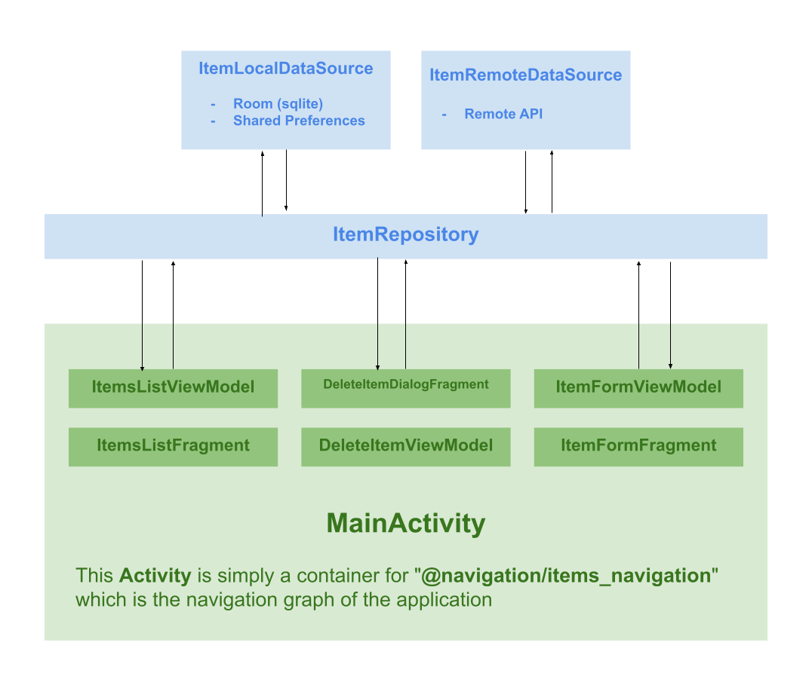
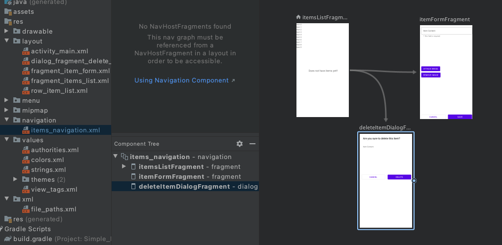
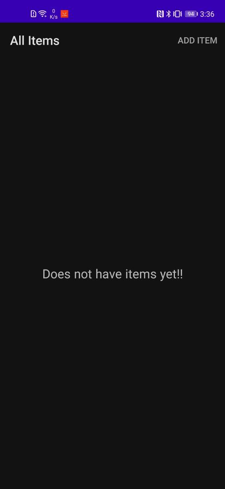
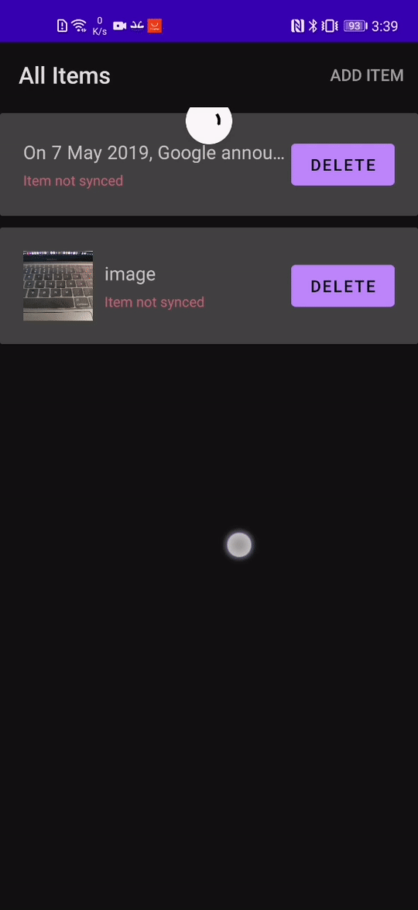
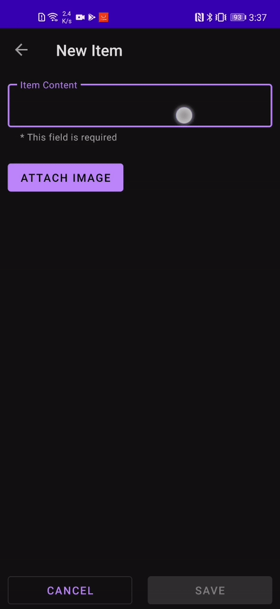
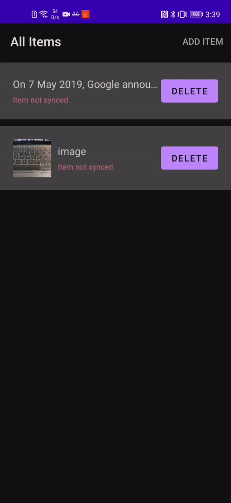
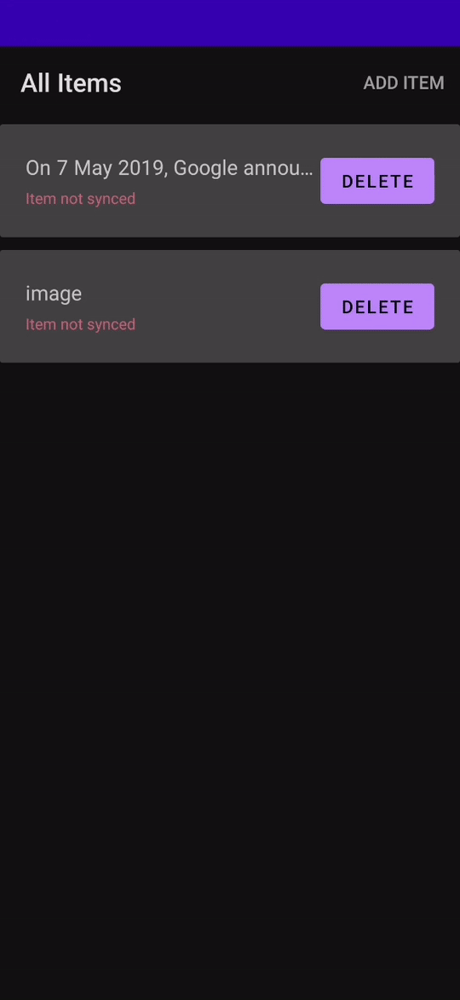
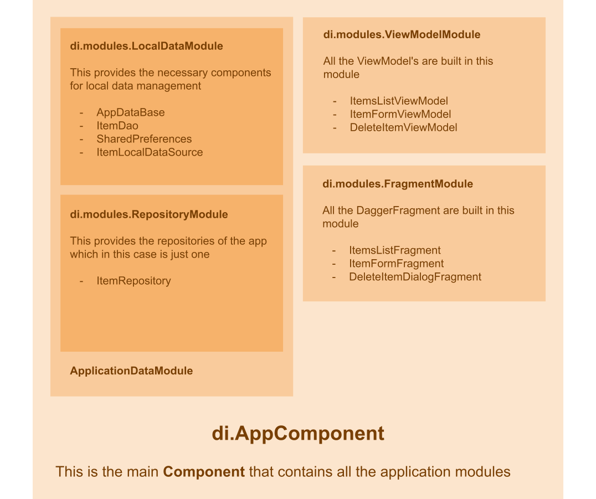

# Simple Android MVVM Sample App

This is just an example code of an Android application based on the MVVM architecture, in this application we will only have a model called `Item` with its two main properties `content` (mandatory String) and `image` (optional Bitmap). The application consists of a list of `Item's` and a form to create and edit `Item's`. In this code a synchronization method with a backend is implemented, for now this backend does not exist but the data synchronization functionality is tested by unit test.

### Backend Sync

This code implements a synchronization method with a backend, when an Item is created or updated, the application will save this locally and it will try to save it externally through a backend, if this is not possible the Item will be saved as "*not synchronized*", in the list of Items the user can do the "pull to refresh" gesture to try to synchronize the data, the application locally stores the last synchronization date in order to obtain only the new changes *(for now this backend does not exist but the functionality data sync is tested by unit test, then the application will behave showing connection errors)*

### Ktlint

Ktlint has been integrated via gradle to ensure good code style.

You can use `./gradlew ktlintCheck` to find style errors or you can use `./gradlew ktlintFormat` to find and fix (if possible) such errors.

### Application Code Layers

This seeks to follow the principle of separation of problems or responsibilities suggested in the [Android development guide](https://developer.android.com/jetpack/guide), then the code will be divided into the following layers:



#### Data Layer - Local Data Sources

Contain the logic to handle the local data of the application

#### Data Layer - Remote Data Sources

Contain the logic to handle the remote data of the application (HTTP API´s, gRPC API´s, Streams of data, etc.).

#### Data Layer - Repositories

In this layer is the logic of the operations of the application and depends directly on the local and remote data sources to be able to complete these operations. For example `ItemRepository` contains the method to save or update an `Item`, in this method it is decided to try to send the data remotely through `ItemsRemoteDataSource` and how to save the data locally through `ItemsLocalDataSource` depending on the response obtained from `ItemsRemoteDataSource`.


*In data management it is important to use code that runs asynchronously, for this it is necessary to understand what type of dispatcher (IO, Default, Main, Unconfined) to use depending on the type of task that is being executed, you can consult this guide: https://developer.android.com/kotlin/coroutines/coroutines-adv for more information.*


#### UI Layer - ViewModel´s

This layer has two main functions:

1.- Hold the necessary data for the state of a view (Data lists, when it should show a load indicator, etc.) This data must be ready to be observed by an Activity, a Fragment or even an XML Layout using [Data Binding](https://developer.android.com/topic/libraries/data-binding). Here it is extremely important to understand that in most cases it is only advisable to expose `LiveData` objects (which can only be observed and not modified) and that only in some cases (such as a form) it might be necessary to expose `MutableLiveData` objects (which In addition to being observed, they can also be modified) You can consult this [guide](https://developer.android.com/topic/libraries/architecture/livedata) to better understand how this type of LiveData and MutableLiveData objects work.

2.- Call repository methods. It is very important that a `ViewModel` has only one dependency and this dependency must be a repository. `ViewModel` must be able to be ready to call methods to send or load data (this in most cases is done with suspended functions via [ViewModelScope](https://developer.android.com/topic/libraries/architecture/coroutines?hl=es-419#viewmodelscope)).

#### UI Layer - Activity / Fragment

In this layer things are no longer just data, this layer is in charge of the visual part of the application, this layer must be ready only to observe the state of the data of the `ViewModel's` and show them to the user as well as wait for the user interaction to simply call the execution of the operations (contained in a Repository). Here there are basically two types of components `Activity` and `Fragment` but in many cases these components only serve as bridges to link a `ViewModel` with an XML layout by using [Data Binding](https://developer.android.com/topic/libraries/data-binding) and [Binding adapters](https://developer.android.com/topic/libraries/data-binding/binding-adapters) (These last two tools have been extremely useful for me to maintain a very clean code in the UI layer).


### Navigation

The navigation of this application is established in `@navigation/items_navigation.xml` which is a [navigation graph](https://developer.android.com/guide/navigation/navigation-getting-started#create-nav-graph)




This navigation graph is injected into `@layout/activity_main.xml` like this:

```xml
<androidx.fragment.app.FragmentContainerView
    android:id="@+id/nav_host_fragment"
    android:name="androidx.navigation.fragment.NavHostFragment"
    android:layout_width="match_parent"
    android:layout_height="match_parent"
    app:defaultNavHost="true"
    app:navGraph="@navigation/items_navigation" />
```


#### Item List Screenshots

|  |  |
| :----------------------------------------------------------: | :----------------------------------------------------------: |


#### Item Form Screenshots

|  |  |  |
| :-------------------------------------------: | :-------------------------------------------: | :-------------------------------------------: |


#### Delete Item Dialog Screenshots

|  |
| :----------------------------------------------------------- |


### Dependency Injection

With the help of Dagger, dependencies are injected into the code components of this application, here is a map of this:




*All code related to dependency injection is in the `package com.mmachado53.simplemvvmapp.di`*


### Tests

For now there are only 3 tests, `ItemRepositoryTest`, `ItemLocalDataSourceTest` and `RomMigrationsTest`, with these 3 tests we cover tests in data layer. *<u>more tests will be added in future for UI layer</u>*

- **ItemRepositoryTest**: This is a local unit test that tests the class `com.mmachado53.simplemvvmapp.data.ItemRepository ` with the help of [Mockito](https://site.mockito.org/).
- **ItemLocalDataSourceTest**: This is an instrumented test that tests the class `com.mmachado53.simplemvvmapp.data.local.ItemLocalDataSource` 
- **RomMigrationsTest**: This is an instrumented test that basically tests the migrations that are implemented in the class `com.mmachado53.simplemvvmapp.data.local.dao.AppDataBase` ( `RoomDatabase`)

To run the tests you can execute:

- Local unit test:  `./gradlew test`
- Instrumented unit test:  `./gradlew connectedAndroidTest`  *(a connected device or emulator is required)*

